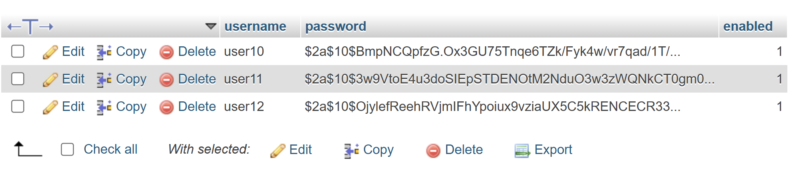

# Application Web pour la getions des patients 

* On utilisant Spring MVC avec Thymeleaf et Sécurité avec Spring security

### Sécurité avec Spring security :

* Pour utiliser Spring sécurité, il faut d'abord ajouter la dépendance Spring sécurité, on peut l'ajouter à traver le site web starter.spring.io:
puis ajouter la dépendance dans le fichier pom.xml : 

 
    
*Aprés d'avoir ajouté spring sécurité, spring suppose que tous les 
requettes doivent etre authentifier, et génere une interface d'authentification et aussi un mot de passe pour acceder

Password: 

Login Interface:

#### NOTES: 
* Cette configuration est juste pour la periode de developement.

### Personnalisé la configuration de spring securité: 
* Il faut creer une classe de configuration SecurityConfig :

#### InMemomy Authentication: 
Pour définir les utilisateurs qui ont le droit d’accéder à l’application, il faut spécifier où Spring Security va chercher les utilisateurs.

Parmi les méthodes, il y a la méthode Authentication consistant à préciser en mémoire quels sont les utilisateurs autorisés à accéder à l’application.
    

* Spring Security utilise par défaut un encodeur de mots de passe (hasher).
Pour indiquer qu’un mot de passe n’est pas haché, on peut ajouter le préfixe {noop} devant le mot de passe.

* Cependant, il est fortement recommandé de créer un PasswordEncoder pour sécuriser les mots de passe.

* On peut, par exemple, utiliser BCryptPasswordEncoder, un algorithme robuste qui permet le hachage sécurisé des mots de passe.

### Afficher l'utilisateur qui est authentifié : 
* Premierement il faut ajouter une dependance de tymeleaf nommer "thymeleaf extras springsecurity6"

* Pour afficher le nom de l'utilisateur, il faut modifier le template en ajoutant l'expression suivante :
    * th:text="${#authentication.name}"

* Bien sûr, il existe d'autres méthodes, mais celle-ci est la plus simple.

* Affichage de l'utilisateur Authentifier (User1) : 

### Ajouter le LOGOUT : 
* On peut Utiliser "th:href="@{/logout}" , mais il y a d'autres methodes.

* Quand on fait un logout, cela ne doit pas se faire via une requête GET, pour des raisons de sécurité.
 En effet, Spring Security ne permet pas de déclencher une action sensible comme la déconnexion via une requête GET, 
 afin d’éviter les attaques de type CSRF. 
##### Ainsi, pour se déconnecter correctement :
  * On effectue un clic sur un bouton.
  * Ce bouton envoie une requête POST à Spring Security, qui traite la déconnexion.

    

##### On peut aussi creer un formulaire :

 

* Actuellement, lorsque l’on clique sur le bouton Logout, on est directement redirigé vers la page de déconnexion, sans passer par 
le mécanisme sécurisé de Spring Security (le bouton utilisant une requête POST). 

 

